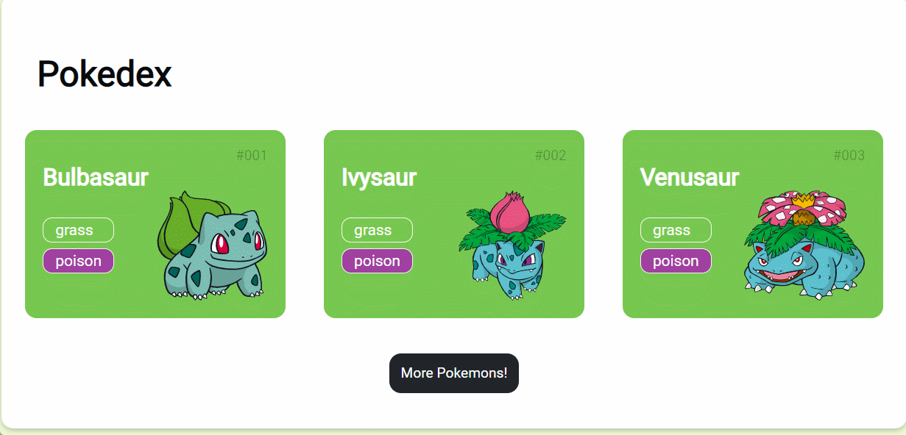
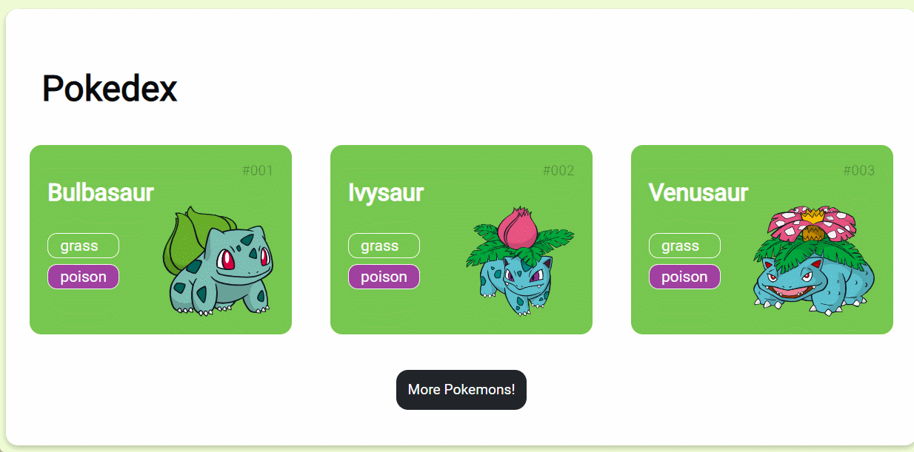

<h1>

</img> 

Pokedex Project

</h1>

## 📒About   

Pokedex criada para o Desafio de Código **"Construindo uma Pokédex com JavaScript"** do 
[ **Bootcamp Fullstack Java+Angular da DIO**.](https://www.dio.me/bootcamp/santander-fullstack-developer,  "DIO Bootcamp link")

O projeto consiste no consumo da PokeAPI para obtenção das informaçãoes dos pokemons listados.

##  PokeAPI

A PokeAPI é uma API dedicada ao universo Pokemon, onde são disponibilizados várias informações sobre os pokemons, incluindo dados sobre espécies, tipos, habilidades, movimentos, e muito mais. 

* [PokeAPI](https://pokeapi.co/)
* [PokeAPI Docs](https://pokeapi.co/docs/v2)

## 🪛Tools
* JavaScript 
* CSS 
* HTML

##

</img>

 

</img>

